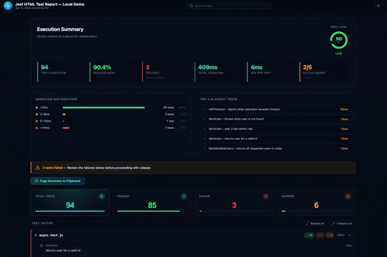

# jest-html-test-report

A sleek, modern HTML test reporter for [Jest](https://jestjs.io/) with a dark glow theme.

- Self-contained HTML output — no external CDN dependencies
- Responsive layout that works on any screen size
- Execution summary with risk level indicator
- Expandable / collapsable test suites
- Filter by All / Passed / Failed / Skipped
- Full-text search across test names and suite paths
- "Copy Summary to Clipboard" button generates a plain-text digest, ready to paste into an email or message
- Dark theme by default; toggleable light theme
- Logo support (PNG, JPG, SVG) — embedded as base64

---

## Preview

Sample report available [here](https://alwaysonlabs.github.io/jest-html-test-report/sample-report.html).



---

## Installation

```bash
npm install --save-dev @alwaysonlabs/jest-html-test-report
# or
yarn add -D @alwaysonlabs/jest-html-test-report
```

> **Peer dependency:** Jest 27 or later is required.

---

## Two ways to generate a report

### Option A — Reporter (automatic, runs during `jest`)

Configure once in `jest.config.js` and the report is written every time `jest` runs.
See [Quick start](#quick-start) below.

### Option B — CLI (from an existing JSON file)

If you already have a Jest JSON output file (e.g. from CI), you can generate the report without touching your Jest config:

```bash
# 1. Run Jest with JSON output (one-time flag, or add to your npm script)
jest --json --outputFile=jest-results.json

# 2. Generate the HTML report
npx jest-test-report jest-results.json
# → writes jest-test-report.html in the current directory
```

**CLI options:**

```text
jest-test-report <results.json> [options]

  -o, --output  <path>      Output HTML path         [default: ./jest-test-report.html]
  -t, --title   <text>      Report page title         [default: "Test Report"]
  -l, --logo    <path>      Path to a logo image (PNG/JPG/SVG)
      --theme   dark|light  Color theme            [default: dark]
      --open                Open report in browser after generation
      --no-env              Omit the Environment section
      --sort    default|status|duration|alphabetical
  -h, --help                Show help
```

**npm script example:**

```json
{
  "scripts": {
    "test":        "jest --json --outputFile=jest-results.json",
    "test:report": "jest-test-report jest-results.json -o reports/test-report.html -t \"My App\""
  }
}
```

---

## Quick start

Add the reporter to your Jest configuration.  
You can use `jest.config.js`, `jest.config.ts`, or the `"jest"` key in `package.json`.

### jest.config.js

```js
module.exports = {
  reporters: [
    'default',                            // keeps the normal terminal output
    '@alwaysonlabs/jest-html-test-report', // adds the HTML report with defaults
  ],
};
```

### With options

```js
module.exports = {
  reporters: [
    'default',
    [
      '@alwaysonlabs/jest-html-test-report',
      {
        outputPath: './reports/test-report.html',
        pageTitle:  'My App — Test Report',
        logo:       './assets/logo.png',
        openReport: true,
      },
    ],
  ],
};
```

### package.json

```json
{
  "jest": {
    "reporters": [
      "default",
      ["@alwaysonlabs/jest-html-test-report", { "outputPath": "./test-report.html" }]
    ]
  }
}
```

After running `jest` (or `npx jest`) the HTML file is written to `outputPath` and a message is printed:

```text
[jest-html-test-report] Report saved → test-report.html
```

---

## Configuration options

All options are optional. Pass them as the second element of the reporter tuple.

| Option | Type | Default | Description |
| ------ | ---- | ------- | ----------- |
| `outputPath` | `string` | `"./jest-test-report.html"` | File path (relative to the project root) where the HTML report is written. Intermediate directories are created automatically. |
| `pageTitle` | `string` | `"Test Report"` | Title shown in the browser tab and at the top of the report. |
| `logo` | `string \| null` | `null` | Path to a logo image (PNG, JPG, GIF, SVG). The image is base64-encoded and embedded into the HTML so the report is fully portable. |
| `theme` | `"dark" \| "light"` | `"dark"` | Initial color theme. The user can also toggle the theme at runtime with the sun icon in the header. |
| `includeFailureMsg` | `boolean` | `true` | When `true`, the full failure message / stack trace is shown below each failing test. |
| `includeConsoleLog` | `boolean` | `false` | When `true`, console output captured during each test file is included in the report. |
| `sort` | `"default" \| "status" \| "duration" \| "alphabetical"` | `"default"` | Sort order for test suites. `"status"` puts failed suites first; `"duration"` puts the slowest suites first. |
| `executionTimeWarningThreshold` | `number` | `5` | Threshold in **seconds**. Tests that exceed this duration are flagged with a ⚠ in the report. |
| `openReport` | `boolean` | `false` | Automatically open the report in the default browser after it is generated. |
| `showEnvironment` | `boolean` | `true` | Render the Environment section (Node version, platform, Jest version, timestamp) at the bottom of the report. |
| `customStylePath` | `string \| null` | `null` | Path to a `.css` file whose contents are appended **after** the built-in styles, letting you override any style without forking the package. |
| `showSupportButton` | `boolean` | `true` | Show the support button in the report header. Set to `false` to hide it. |
| `executionSummarySubtitle` | `string` | `"Quality metrics at a glance for stakeholders"` | Subtitle text displayed beneath the "Execution Summary" heading. |
| `riskThresholds` | `object` | `{ low: 90, medium: 70 }` | Pass-rate percentages that determine the **Risk Level** label and donut-chart color. See below. |
| `durationThresholds` | `number[]` | `[300, 1000, 2000]` | Millisecond breakpoints used to bucket tests in the **Duration Distribution** card. N values produce N+1 buckets. See below. |

### `riskThresholds`

```js
riskThresholds: {
  low:    90,   // pass rate >= 90 % → "Low"   (green)
  medium: 70,   // pass rate >= 70 % → "Medium" (amber)
                // pass rate  < 70 % → "High"   (red)
}
```

### `durationThresholds`

An array of millisecond values that define the boundaries of the **Duration Distribution** chart shown in the report. N thresholds produce N+1 buckets: everything below the first value, each intermediate range, and everything above the last value. The array is sorted automatically, so order does not matter.

```js
// Default — creates four buckets:
//   < 300 ms | 300–1000 ms | 1000–2000 ms | > 2000 ms
durationThresholds: [300, 1000, 2000]
```

Custom example for a faster suite:

```js
// Creates three buckets:
//   < 50 ms | 50–200 ms | > 200 ms
durationThresholds: [50, 200]
```

### Full example

```js
// jest.config.js
module.exports = {
  reporters: [
    'default',
    [
      '@alwaysonlabs/jest-html-test-report',
      {
        outputPath:   './reports/index.html',
        pageTitle:    'Acme Corp — CI Test Report',
        logo:         './assets/logo.svg',
        theme:        'dark',
        sort:         'status',
        includeFailureMsg:  true,
        includeConsoleLog:  false,
        executionTimeWarningThreshold: 3,
        openReport:   false,
        showEnvironment: true,
        customStylePath: './jest-report-overrides.css',
        riskThresholds: {
          low:    95,
          medium: 80,
        },
        durationThresholds: [100, 500, 1500],
      },
    ],
  ],
};
```

---

## Custom styles

Create a plain CSS file and point `customStylePath` at it.  
Your rules are appended last, so they take precedence over the defaults.

```css
/* jest-report-overrides.css */

:root {
  /* swap accent color from teal to purple */
  --accent:        #a855f7;
  --accent-bright: #c084fc;
  --accent-glow:   rgba(168, 85, 247, 0.18);
  --accent-border: rgba(168, 85, 247, 0.22);
}

.header-title h1 {
  font-size: 1.3rem;
}
```

---

## Integrating with CI

Because the report is a single, self-contained HTML file you can:

- **Archive it** as a CI artifact (GitHub Actions, GitLab CI, CircleCI, etc.)
- **Serve it** with any static-file server for team review
- **Email it** — use the built-in "Copy Summary to Clipboard" button to grab a plain-text digest

### GitHub Actions example

```yaml
- name: Run tests
  run: npx jest

- name: Upload test report
  if: always()
  uses: actions/upload-artifact@v4
  with:
    name: jest-test-report
    path: jest-test-report.html
```

---

## License

MIT
